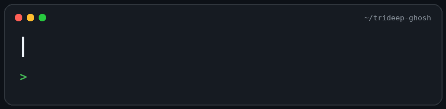

  

<h3 align="left">Connect with me:</h3>

  
  
  

### Senior Full-Stack Engineer · Bengaluru, India

🚀 I build enterprise SaaS platforms end to end: architecture, implementation and rollout. At E9 (Nov 2020 – Jul 2026) I grew from Software Developer to Senior Full-Stack Developer. My work covers enterprise authentication (Okta, SAML 2.0, role-based access control), workflow orchestration across multiple client environments, and real-time messaging on WebSockets with Redis and Google Pub/Sub.

### What I've Built

- 🔐 **Enterprise Authentication Platform**: Okta single sign-on over SAML 2.0 with Passport.js and JWT, a route-to-permission RBAC model enforced by middleware, and a login audit trail.
- ⚙️ **Workflow and Asset Automation**: a repository-driven orchestration platform (Node.js, Vue.js, MySQL, GitLab and Jira APIs) with reusable automation modules, a visual workflow canvas, scheduled execution and webhook-based sync, plus Flexera One integrations that replaced manual audits.
- 📡 **Real-Time Messaging Infrastructure**: Socket.IO WebSockets with a JWT-authenticated handshake, per-tenant and per-user rooms, a Redis adapter and Google Pub/Sub sync, with Firebase Cloud Messaging push for offline clients.
- 🧩 **Dynamic Form Builder**: drag-and-drop form authoring in Vue.js with Jira REST API ticket creation and configurable per-client branding.
- 🛠️ **Background Jobs**: BullMQ and Redis queues with retries, exponential backoff and scheduled jobs for a multi-tenant transportation SaaS platform on Node.js and SQL Server (Prisma).
- 🧪 **Quality Engineering**: a Cypress end-to-end framework with custom commands, stable `data-testid` selectors, network interception and fixtures across login, roles, vault access and the form builder.

### Rapid Fire

- 💬 Ask me about: **Node.js, event-driven architecture, WebSockets, MongoDB, auth and SSO, Vue.js**
- 🌱 Currently going deeper on: **React, TypeScript, PostgreSQL, system design at scale**
- ⚡ Fun fact: **🎢 I once debugged an issue while on a roller coaster!**

### Skills

**Languages and Runtime**

   

**Frontend**

   

**Data, Caching and Queues**

      

**Cloud, Infra and Messaging**

      

**Auth and Security**

    

**Integrations**

   

**Testing and Tooling**

   